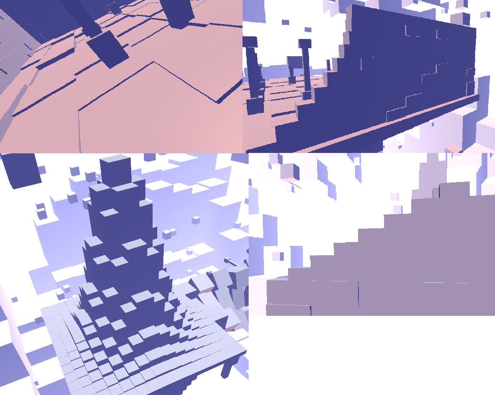

# White Chapel - Interactive 3D Graphics 2019 - Marco Iuri

## Descrizione generale del progetto

L'idea di partenza è stata quella di creare un ambiente 3D che desse l'idea di un "mondo digitale" prendendo ispirazione dalle mappe Copied City e Tower del videogioco Nier Automata ([Copied City](https://steamuserimages-a.akamaihd.net/ugc/947341295631366587/AB7D5149E653F0F5018483E310B4545002E49A48/), [Tower](https://lparchive.org/NieR-Automata/Update%20135/)) per l'impostazione generale e dalla mappa Vetta dell'Arcidrago di Dark Souls 3 per l'idea di base dell'edificio più grande (in origine prevedeva una cupola e degli archi poi eliminati perchè avrebbero richiesto troppo tempo rispetto alle scadenze prefissate).

Durante lo sviluppo si è poi voluto puntare sull'ottenere un livello di dettaglio quanto più fine possibile (almeno per i soggetti centrali della scena) mantenendo però un codice abbastanza semplice da garantire il completamento del lavoro entro i tempi stabiliti; in virtù di ciò la generazione procedurale di alcuni elementi (come, ad esempio, i mattoni dei muri, le piastrelle dei pavimenti e i basamenti delle due isole) ha avuto un ruolo centrale nel raggiungimento degli obiettivi prefissati. 
Di seguito è possibile vedere alcuni esempi di dettagli o elementi generati in maniera procedurale:

Un altro obiettivo è stato quello di ottenere una resa grafica che fosse semplice ma piacevole da vedere e, a tal fine, si è optato per utilizzare dei semplici cubi bianchi per costruire l'intera scena andano poi a rendere la tridimensionalità ed i colori tramite le luci e il postprocessing (in analogia a quanto viene fatto nelle due mappe di Nier Automata citate in precedenza).

I file di progetto sono organizzati nel seguente modo:

I due file principali sono:
*   **WhiteChapel.js**: contiene il codice per la generazione di geometrie, materiali e mesh della scena nonchè alcune definizioni di variabili globali accessorie;
*   **WhiteChapel.html**: contiene il codice dell'applicazione vera e propria;

## Fasi dello sviluppo

Lo sviluppo è stato diviso nelle seguenti fasi cercando di mantenere un'organizzazione rigida anche dal punto di vista temporale.

### Organizzazione generale del progetto
In questa prima fase si è andata a definire un'organizzazione di base del processo di sviluppo andando a definirne le varie fasi in maniera grossolana: tale "approssimatezza" deriva dal fatto che, in corso d'opera, avrebbero potuto verificarsi dei problemi che richiedenti una riorganizzazione del piano (ad esempio andando ad eliminare alcune fasi o ad inserirne di altre) e, di conseguenza, non aveva senso andare a definire un piano definito nei dettagli che poi, probabilmente, sarebbe stato modificato.

Un esempio di questa variabilità del piano di sviluppo la si può vedere già nelle prime giornate del diario di sviluppo: inizialmente si era pensato di organizzare la scena in Unreal Development Kit per poi rifarla in three.js ma, siccome lavorare direttamente in three.js è risultato essere molto più efficiente, questa prima fase è stata eliminata.

I tool utilizzati per lo sviluppo sono stati:
*   **Visual Studio Code** per la scrittura del codice;
*   **GIMP 2.10.6** per la realizzazione della heightmap;
*   **XAMPP v3.2.2** e **Chrome 73.0.3683.86** per il testing;

### Realizzazione della scena
In questa fase sono stati realizzati tutti gli oggetti presenti nella scena, la quale è composta principalmente da cinque elementi:
1.  *Isola grande*: l'isola più grande con l'edificio in rovina a colonne (che in principio prevedeva la cupola);
2.  *Isola piccola*: l'isola più piccola con la chiesetta;
3.  *Ponte avvitato*: un ponte di collegamento fra le due isole che ruota di 180° passando da una all'altra;
4.  *Cubi flottanti*: dei cubi grandi 2x2x2 che si muovo in maniera casuale per la scena;
5.  *Terreno speculare*: due terreni generati dalla stessa heightmap e posizionati in maniera speculare l'uno rispetto all'altro.

Da un punto di vista temporale la realizzazione dei singoli elementi ha richiesto più o meno una giornata ma per i cubi flottanti (che hanno anche la necessità di essere animati) lo sviluppo ha richiesto complessivamente tre giornate a causa della difficoltà della gestione delle collisioni fra essi.

Come già detto la costruzione degli elementi della scena si basa fortemente su un approccio procedurale (sebbene la scena poi nel complesso sia stata generata disponendo manualmente i vari elementi), in particolare:
*   Per la realizzazione dei pavimenti piastrellati e dissestati è stata sfruttata una griglia di box con larghezza e profondità uguali scalandone casualmente l'altezza rispetto ad un valore medio in comune;
*   Per i dettagli dei muri si sono generati dei mattoni (con la loro geometria predeterminata) in posizioni casuali di una griglia che copre tutto il muro;
*   Per la realizzazione della parte rotta dei muri e per gli elementi triangolari della chiesetta sono stati utilizzati invece dei cubi scalati secondo una funzione precalcolata (quadratica per la parte rotta dei muri, lineare per le parti triangolari);
*   Per la realizzazione delle parti "inferiori" delle due isole è stato sfruttato un metodo simile a quello usato per i pavimenti ma al posto di uno scaling casuale ne è stato utilizzato uno basato su una funzione gaussiana della distanza del blocco dal centro della griglia.

### EXRA - postprocessing e GUI
Nelle ultime due giornate è stato implementato l'effetto fog/bloom e l'interfaccia utente che permette di controllare alcuni parametri dell'applicazione.

Per ottenere questo effetto si sfrutta la texture contenente il depth buffer dell'operazione di rendering precedente: tale profondità viene sommata al colore della texture diffuse ottenuta dalla scena originale facendo sì che il colore finale si schiarisca con la distanza dando vita ad un effetto nebbia.
L'utilizzo di uno sfondo bianco poi fa sì che questo effetto dia anche un'idea di bloom dovuto alla luce proveniente dall'esterno.

## Risultato finale

Di seguito è visibile un video che dimostra le caratteristiche dell'applicazione nella sua versione finale:

<iframe width="560" height="315" src="https://www.youtube.com/embed/bOtyXwKqfQ4" frameborder="0" allow="accelerometer; autoplay; encrypted-media; gyroscope; picture-in-picture" allowfullscreen></iframe>>

## Evoluzioni future

Per quanto riguarda eventuali sviluppi futuri si intende migliorare la gestione delle collisioni fra i cubi volanti e i limiti del volume (ora la velocità del cubo incidente sul bordo del volume viene semlicemente invertita); inoltre si pensa di utilizzare questa scena come terreno di prova per sperimentare metodi di illuminazione e materiali più avanzati.

## Fonti
*   Lettura del depth buffer per postprocessing: (https://threejs.org/examples/#webgl_depth_texture);
*   Interfaccia utente: (https://codepen.io/programking/pen/MyOQpO);