# Diario di sviluppo

## Sinossi

Nel seguente documento saranno riportate tutte le fasi dello sviluppo del progetto _Boxes_  per il corso di _Interactive 3D Graphics_ dell'_Università degli Studi di Udine_ con particolare attenzione alle scelte progettuali effettate, ai problemi incontrati e le rispettive soluzioni.

Il progetto verterà sulla realizzazione di una scena 3D composta unicamente da cubi bianchi di varie dimensioni prendendo ispirazione da alcuni ambienti del videogioco _NieR: Automata_ come la
_Copied City_ ([esempio 1](https://i.pinimg.com/originals/20/b8/c5/20b8c50b9ab9b90f5bef86c0ce2d386d.jpg), [esempio2](https://steamuserimages-a.akamaihd.net/ugc/947341295631366587/AB7D5149E653F0F5018483E310B4545002E49A48/)) o la _Tower_ (di cui purtroppo non ho trovato esempi da linkare direttamente, lascio comunque una [pagina](https://lparchive.org/NieR-Automata/Update%20135/) in cui è possibile vederne varie viste dell'interno).
Altra ispirazione è stata la serie di Dark Souls per i suoi ambienti in rovina (in particolare la mappa Vetta dell'Arcidrago e la mappa Ringed City del terzo capitolo).
Per ottenere quindi il risultato voluto (il gioco di luci ombre che rende belli questi ambienti) si utilizzerà il codice di partenza contenente un semplice lightset (che verrà opportunamente modificato).

## 26/03/2019 - Giorno 1: organizzazione del lavoro

Lo sviluppo del progetto sarà organizzato, in linea di massima, come segue:

1. Design della scena su carta e UDK;
2. Calcolo delle operazioni rotazione, traslazione e scalatura necessarie;
3. Ricostruzione della scena con three.js;
4. Ottimizzazione della scena;
5. Studio delle animazioni della scena;
6. Implementazione delle animazioni;
7. Validazione del risultato;
8. Eventuali extra per migliorare la resa finale (da definire);

## 27/03/2019 - Giorno 2: inizio design della scena 3D

Nella presente giornata è iniziato il lavoro di design della scena 3D effettuato avvalendosi di UDK (Unreal Developtment Kit) e bozzetti su carta.

In questa prima giornata si è iniziata a comporre l'isola flottante più grande delle due che comporranno la scena finale andando a definire la forma e la disposizione delle colonne che formano l'edificio ivi presente nonchè definendo dimensioni e posizione dei muri dello stesso.

Inizialmente l'idea era di costruire l'intero edifico completo (vedi bozzetti sotto) per poi andarlo a "anticare" eliminando delle parti in modo da dare l'impressione di una costruzione in rovina, purtroppo però il tempo disponibile è troppo poco per questo tipo di approccio quindi si proseguirà a definire l'edificio direttamente nella sua forma definitiva.
L'idea è di finire il design della scena su UDK e iniziare a portarlo su threejs entro domenica 31/03/2019 al fine di avere sufficiente tempo per dedicarsi, appunto, al porting della scena su threejs e alla realizzazione delle animazioni dei cubi flottanti nonchè allo studio di alcune soluzioni di illuminazione per rendere la scena più piacevole da vedere.

Si annotano di seguito alcune idee pensate in corso d'opera:

* Per la realizzazione del pavimento della zona centrale del primo edifico si è pensato di realizzare una griglia di boxes adiacenti (in modo da coprire tutta l'area necessaria) con stessa larghezza e profondità andando a variarne leggermente e casualmente l'altezza intorno ad un valore medio uguale per tutti: in questo modo si può ottenere l'effetto di un pavimento tassellato e sconnesso;
* Per la realizzazione della parte inferiore dell'isola flottante si utilizzerà un approccio analogo a quello precedente ovvero si considererà un griglia di parallelepipedi la cui altezza sarà modulata da una funzione gaussiana bidimensionale (così da ottenere la forma visibile nei bozzetti);
* I cubi flottanti potrebbero essere generati casualmente all'inizializzazione della scena (evitando ovviamente che vadano ad intersecarsi con gli edfici o le isole flottanti).

### Bozzetti:
Varie viste dell'edifico della prima isola
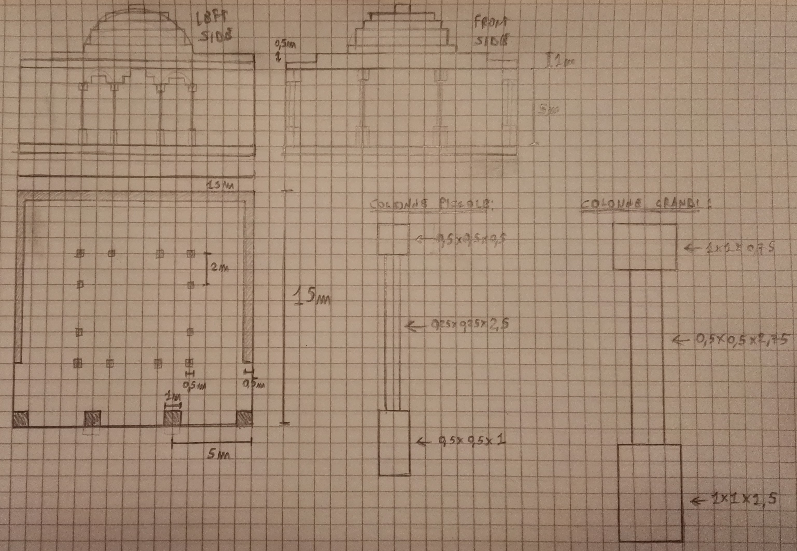

Semplice schema per avere un'idea di come dovrebbe venire la parte inferiore delle isole flottanti (da estendere ovviamente in 3D)
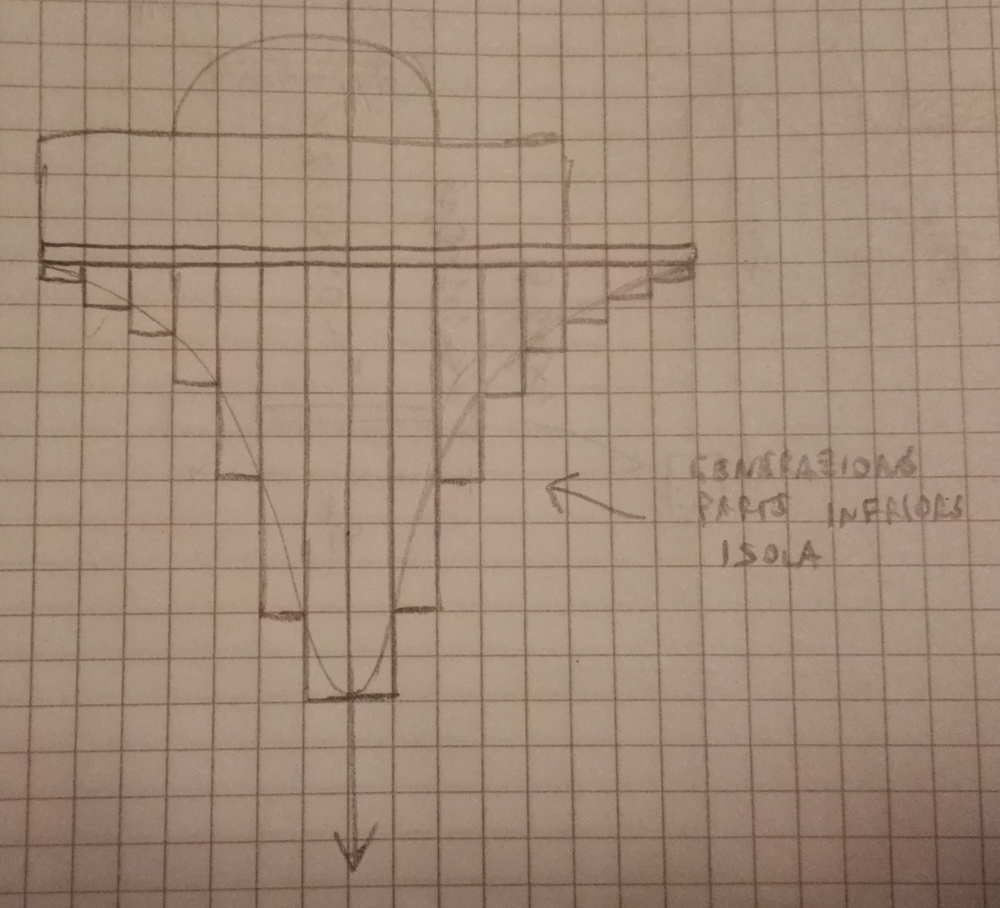

## 28/03/2019 - Giorno 3: organizzazione della scena e inizio implementazione

Dopo aver ragionato sull'efficacia dell'approccio "design su UDK e trasposizione su three.js" e a fronte di alcuni test effettuati su three.js, si decide di eliminare il design preliminare su UDK per focalizzarsi sulla relizzazione diretta della scena in javascript.
Per semplificare tale lavoro è stata scelta la seguente organizzazione gerarchica della scena che permette di ridurre al massimo i gradi di libertà dei singoli oggetti (nel senso di renderne posizioni e rotazioni il più relative possibile) in modo da rendere semplice calcolarne le posizioni all'interno della scena (si passa dal dover calcolare posizioni assolute, che risulta piuttosto difficile vista la complicatezza della scena in oggetto, a posizioni relative che permettono un minor "sforzo" e quindi accelerano lo sviluppo):

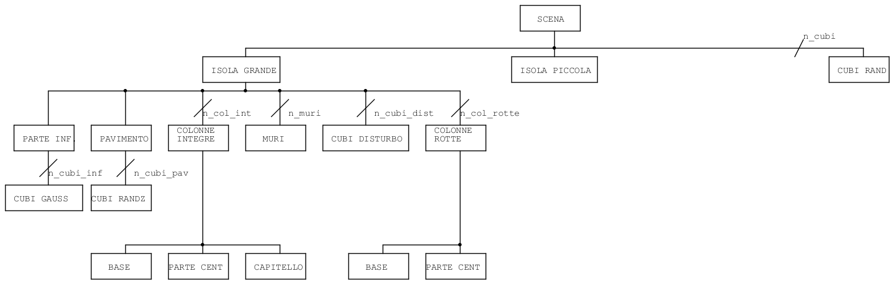

Seguendo quanto detto nel paragrafo precedente si è proceduto all'implementazione della scena in javascript andando, inoltre, a porre le basi per la struttura stessa del codice (aggiungedo il file sorgente SceneActors.js che conterrà tutti i costruttori e le variabili relative agli oggetti in scena, successivamente si andranno a spostare le funzioni ausiliarie, ora contenute in questo stesso file, in un sorgente apposito per rendere il codice più ordinato).
Attualmente la prima isola flottante è completa di colonne (rotte e intere), pavimento "dissestato" e parte inferiore generata tramite una funzione gaussiana.
Durante il testing di questa versione del codice si è notato, però, che le prestazioni vengono notevolmente influenzate dall'abilitazione delle ombre per i vari oggetti che compongno la scena, si è proceduto, quindi, ad un confronto dei risultati ottenuti con o senza ombre (vedi immagini sotto):

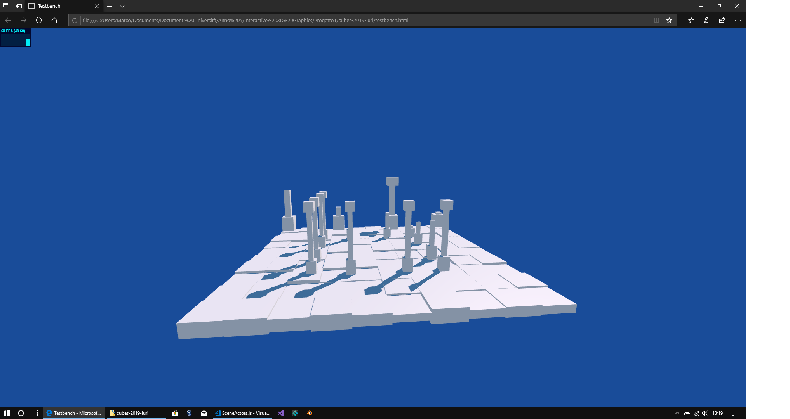
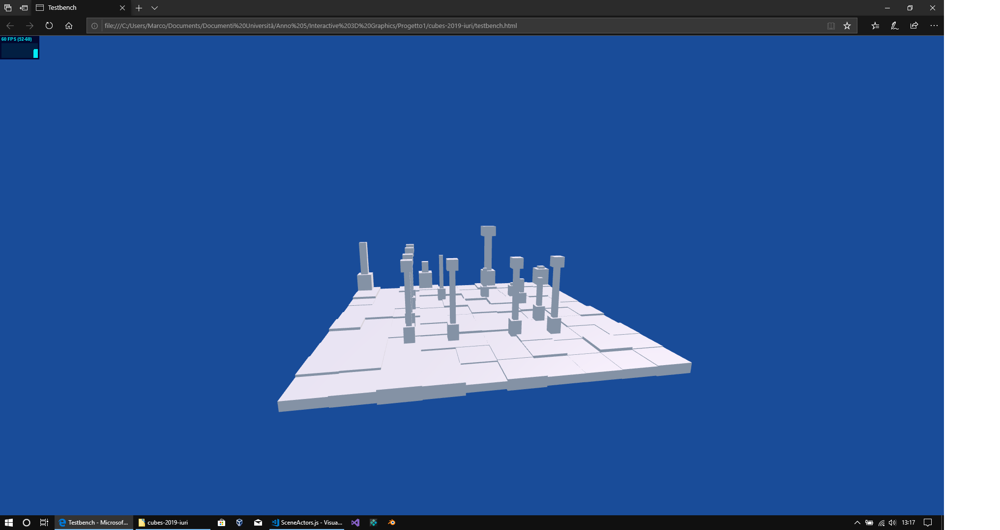
NOTA: queste immagini si riferiscono ad una versione vecchia senza ancora la parte inferiore dell'isola.

Si vede chiaramente come la prima sembri più realistica ma la seconda da maggiormente la sensazione di "mondo digitale" che si intende dare alla scena: si manterrà quindi la versione senza ombre fino alla fine dello sviluppo della versione di base del software, nel caso poi avanzi tempo per cercare di migliorare l'accuratezza dell'illuminazione (oltre alle "semplici" ombre) si andrà a riutilizzare la versione ombreggiata.

Un ulteriore modifica apportata al codice (dovuta a dei test fatti con le ombre) è stata separare i materiali delle varie parti della scena (in precedenza era presente un solo materiale): questo è stato necessario a causa di un bug di threejs nella gestione delle ombre che da problemi quando uno stesso materiale è utilizzato sia per oggetti che ricevono le ombre sia per oggetti che non le ricevono.

## 29/03/2019 - Giorno 4: fine realizzazione prima isola

Dopo alcuni ragionamenti sulla struttura da dare ai file sorgenti dell'applicazione si è arrivati alla conclusione che non ha senso averne di vari separati in quanto ci si troverebbe poi a doverli includere uno ad uno nel file html finale: per garantire quindi una migliore portabilità dell'applicazione, le funzioni che la compongono verrano inserite in un unico file WhiteChapel.js: grazie a questo approccio gli oggetti della scena 3D "dichiarati" in questo file potranno essere riutilizzati in altri progetti threejs senza dover includere uno alla volta i relativi file sorgente.

Nella giornata di oggi si è proceduto ad implementare i muri in rovina presenti sulla prima isola (la parte con la cupola e gli archi presenti nei bozzetti iniziali è stata scartata per questioni di tempo e anche per non appesantire troppo l'applicazione, che già ora comincia ad aver problemi a girare a 60 fps fissi nel caso di movimenti rapidi della telecamera). Per ottenere dei muri in rovina belli a vedersi senza andare a specificare ogni singolo mattone (che avrebbe anche un grosso impatto in termini di peformance) si è andati ad utilizzare un approccio "procedurale" simile a quello usato per il pavimento e per il "basamento" dell'isola flottante.

Per prima cosa il muro è stato diviso in due parti come visibile nel seguente bozzetto:

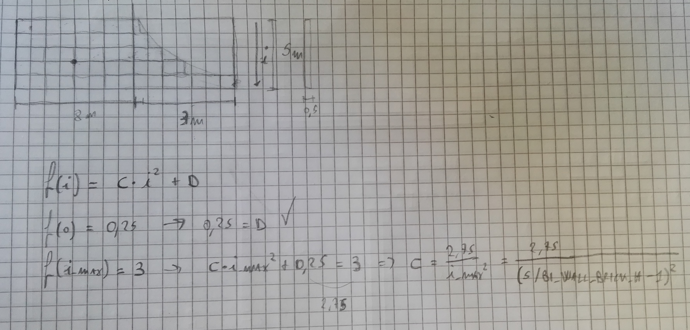

La parte a sinistra (con il pivot del muro al centro) è composta da una box di dimensioni 8x5x0.5 e da n (in questo caso 10) mattoni grandi 1x0.5x0.6 che vengono posizionati casualmente nell'area della box grande.

La parte a destra è invece ottenuta tramite la funzione f(i) che è stata ricavata come visibile nel bozzetto: nella pratica andiamo a generare delle box poste una sopra l'altra la cui lunghezza è modulata dalla funzione f(i) (dove i è l'indice della box nell'apposito vettore); la mesh utilizzata per queste box è la stessa utilizzata per i mattoni random della parte a destra, di seguito è possibile osservare il risultato finale:

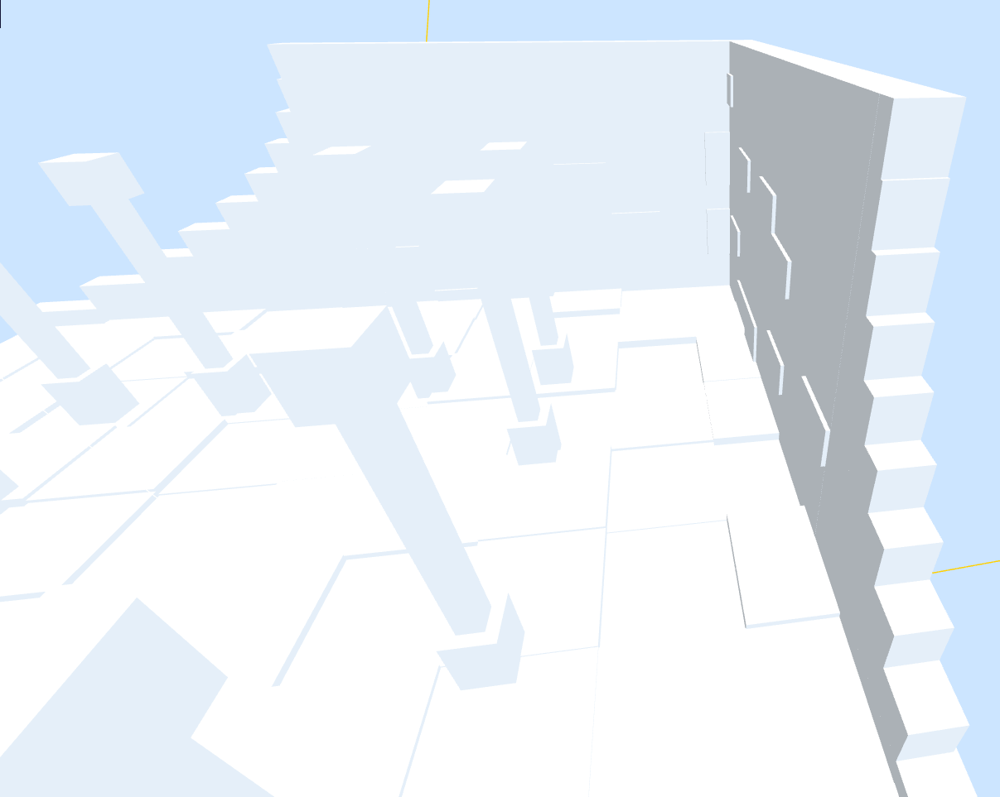

Si fa notare che la lunghezza della parte destra del muro è impostabile come parametro nella funzione costruttore: in questo modo è stato possibile ricavare due muri di lunghezza diversa.

Di seguito si mostra l'attuale stato dell'isola grande alla quale manca solo un piccolo ponte che la collegherà a quella piccola (le linee visibili sono dovute all'attivazione di un helper per la luce direzionale della scena):

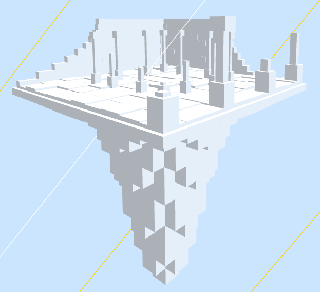

## 31/03/2019 - Giorno 5: realizzazione della seconda isola

Nella presente giornata si è prceduto a realizzare al scenda isola con la chiesetta: non c'è molto da dire su questa parte in quanto sono stati riutilizzati principalmente oggetti già realizzati per l'altra parte della scena; a tal fine si sono apportate piccole modifiche ai costruttori di RuinedWall, TesselFloor e IslandBasement per poterne controllare le dimensioni.

Sono comunque stati aggiunti due nuovi costruttori, uno per l'oggetto RightTrangle (triangolo rettangolo, utilizzato per realizzare le parti rettangolari della struttura della chiesetta) e uno per l'oggetto ChapelAltar (per realizzare l'altare della chiesetta). In particolare per il costruttore dell'oggetto RightTrangle è stato applicato un approccio simile a quello utilizzato per la parte rotta del RuinedWall sostituendo la funzione quadratica con una lineare.

Il risultato finale è il seguente:
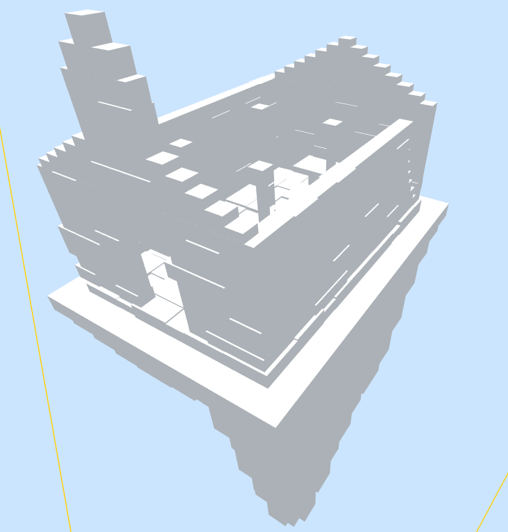

Bozzetti preapratori per la chiesetta:
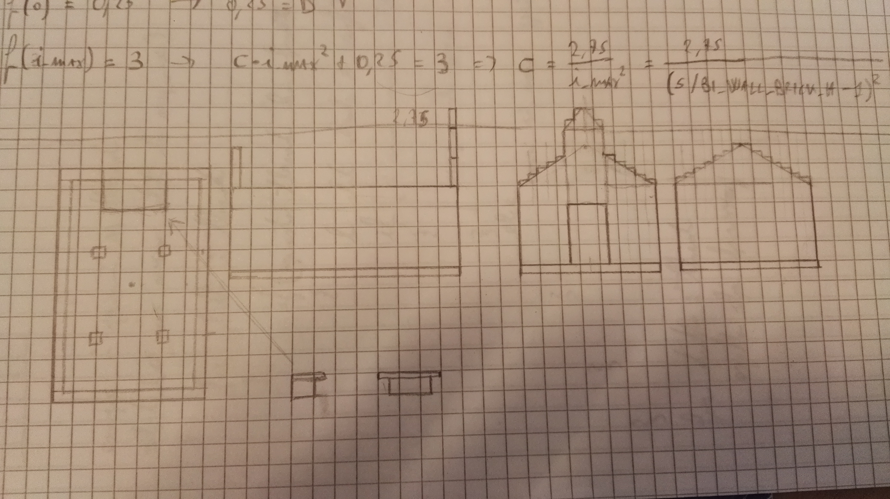

## 01/04/2019 - Giorno 6: realizzazione del ponte di collegamento

Oggi si andrà a realizzare il ponte di collegamento fra le due isole.

Inizialmente l'idea era di fare un ponte arcuato in rovina (quindi cn alcune parti del pavimento e dei lati mancanti) ma, dopo alcune sperimentazioni, si è deciso di cambiare completamente strada: al fine di dare una maggior sensazione di stranezza allo spettatore si è scelto di cambiare la struttura della scena andando a costruire un ponte che ruota su se stesso di 180° passando dalla isola grande all'isola piccola andando poi a capovolgere la stessa.

Di seguito si possono vedere i bozzetti del ponte con il calcolo delle funzioni necessarie per realizzarlo:
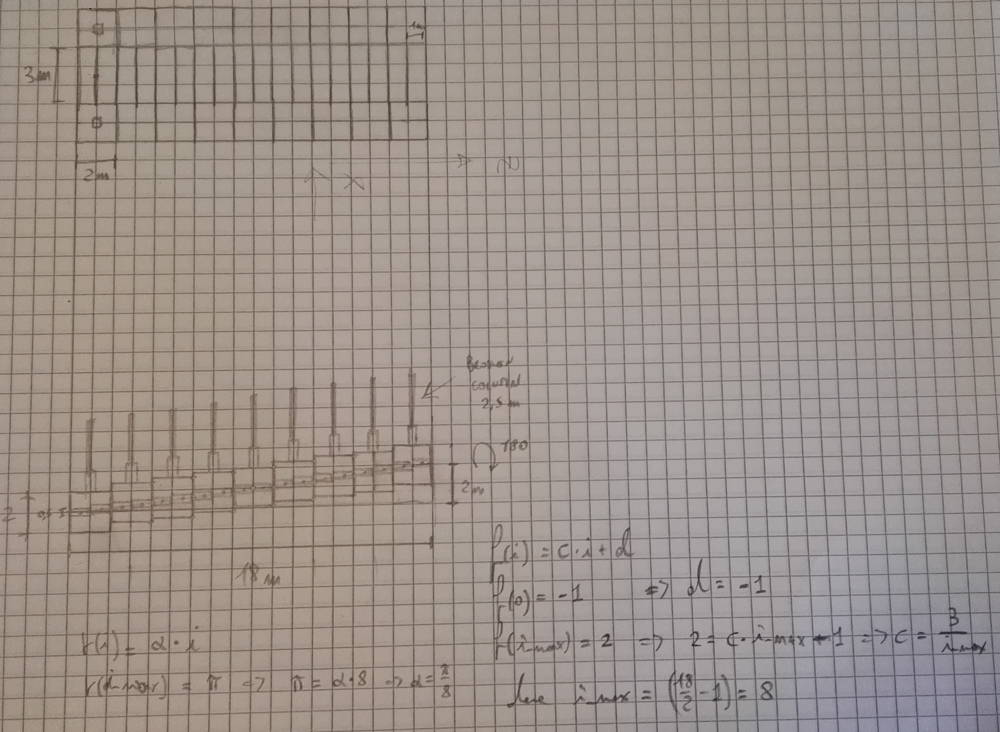

Dopo averlo implementato in javascript il risultato è il seguente:
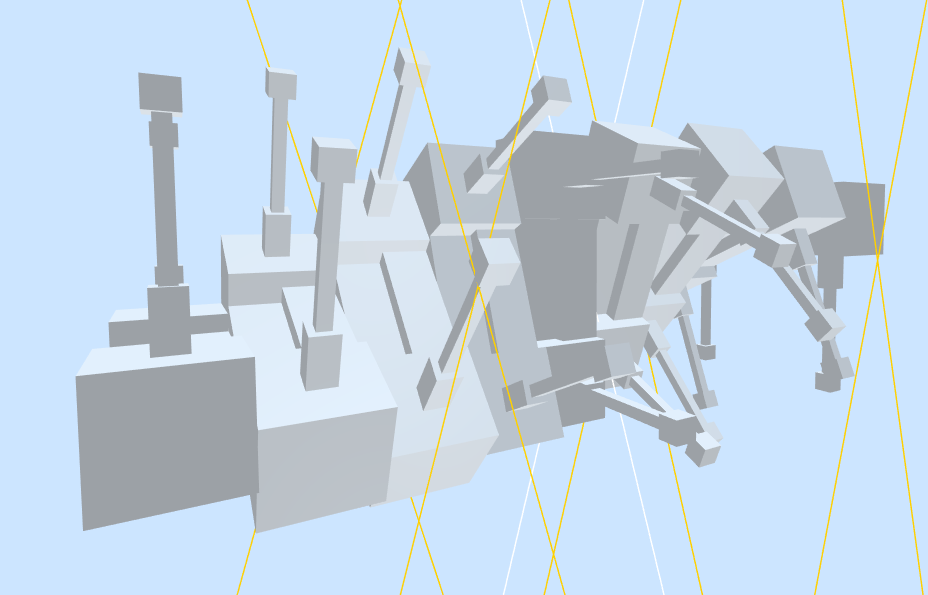

A questo punto la scena si presenta come segue, mancano solamente i cubi flottanti animati (che verranno aggiunti nella prossima giornata) e il terreno (a proposito del quale ci sarà una nota più sotto):
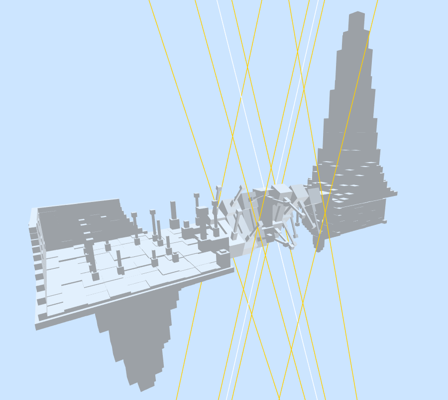
Si fa notare che è stata aggiunta una luce speculare alla prima per mantenere il senso di "indifferenza fra sopra e sotto".

NOTA: per il terreno si è pensato di generarne due copie speculari a partire dalla singoa heightmap, una sotto le isole e una sopra così da dare ancora "stordire" ancora di più lo spettatore non facendoli capire qual'è il sopra e qual'è il sotto.
Inoltre, per rendere maggiormente questa sensazione, si è pensato di eliminare i controlli orbitali e permettere il movimento della camera solo a livello del suolo (comunque questa sarà una cosa più implementata eventualmente alla fine se avanzerà del tempo).

## 02/04/2019 e 03/04/2019 - Giorni 7 e 8: gestione dei cubi casuali animati

In queste due giornate si è proceduto ad implementare il costruttore dei cubi casuali e le funzioni di animazione degli stessi.
Ogni cubo viene generato in una posizione casuale con una velocità diretta casualmente ma con ampiezza uguale a quella degli altri cubi, quando avviene una collisione fra due cubi vengono calcolate le direzioni di uscita dalla collisione ma le velocità rimangono, in modulo, le stesse.
Inoltre, per evitare compenetrazioni con gli elementi principali della scena, si è resa "off-limits" l'area centrale facendo sì che ad ogni cubo che si avvicina ad essa venga invertita la direzione (un approccio analogo è stato utilizzato per costringere i cubi all'interno di un volume predeterminato in modo che non si perdano tutti all'infinito).

Particolarmente complicata è stata la gestione delle collisioni fra i cubi, in particolare la determinazione delle velocità di uscita (ciò ha portto il lavoro a prendere un giorno in più di quanto preventivato): alla fine si è optato per il seguente algoritmo:

1.  Calcola il vettore distanza fra il second cubo e il primo;
2.  Calcola i componenti delle velocità dei due cubi rispetto al vettore distanza appena calcolato (cube_a_comp, cube_b_comp);
3.  Calcola le velocità di uscita tramite le formule:
    * v1out = v1in + (cube_b_comp - cube_a_comp)*distance_vector;
    * v2out = v2in + (cube_a_comp - cube_b_comp)*distance_vector;
4. Normalizza le velocità ottenute (ricordiamo che sono direzioni, il modulo della velocità lo vogliamo costante);

Il numero di cubi in scena nella versione attuale è 1000 in un volume di lato 100, volendo si potrebbero utilizzare un numero di cubi più grande ma questo porterebbe ad un conseguente calo delle prestazioni dovuto alla ricerca delle collisioni.